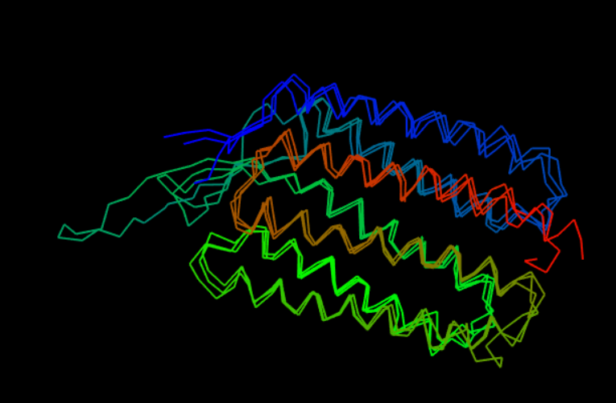
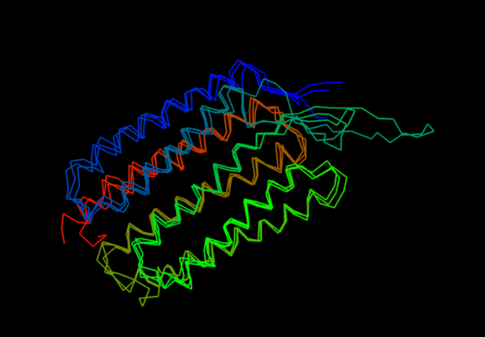

```{r setup, include=FALSE}
knitr::opts_chunk$set(echo = TRUE)
```

The code in this document is made to be useful with either the long or the short ORF, but in the set-up below the sequence to use is set to the long ORF.

```{r, message = FALSE}
# Set-up
library("bio3d")
library("ggplot2")
library("ggrepel")
library("msa")
library("bio3d.view")

# Load sequence of POI
seqL <- read.fasta("long.ORF.fa")
seqS <- read.fasta("short.ORF.fa")

#Choose which sequence to use
seq <- seqS
```

After set up the blast search can be completed and the summary statistics of this search can be plotted.

```{r}
# Blast search
blast <- blast.pdb(seq, database = "pdb")

# Plot summary statistics of results
hits <- plot(blast)

# Print the IDs of the hits above the threshold
hit.IDs <- hits$pdb.id
hit.IDs

```

There are `r length(hit.IDs)` hits that pass the statistical threshold, namely: `r hit.IDs`. More information can be found on these by interrogating the blast results.

```{r}
# Show the hit table for the top hits which pass the threshold
head(blast$hit.tbl, n = length(hit.IDs))
```


We can also download these PDB files, annotate them for more information and align them with our sequence to get an overview of sequence alignment.

```{r, warning=FALSE}

# Download related PDB files
files <- get.pdb(hits$pdb.id, path="pdbs", split=TRUE, gzip=TRUE)

# Align related PDBs
pdbs <- pdbaln(files, fit = TRUE, exefile="msa")

# Vector containing PDB codes for figure axis
ids <- basename.pdb(pdbs$id)

# Annotate hits for more information on the hits
anno <- pdb.annotate(ids)

# Find the organisms these PDB hits come from
unique(anno$source)

# View more information on the hits
anno

# Draw schematic alignment
plot(pdbs, labels=ids)
```

We can also plot the three structures we have found as follows:

```{r, message = FALSE}
# Set up
library(bio3d.view)
library(rgl)

# Plot
#view.pdbs(pdbs)
```

The `View.pdbs()` function brings up an interactive viewer, which cannot be directly viewed in the markdown document, so instead two screen-shots of this have been inserted.





With more proteins it could be interesting to plot variability, or even do PCA using the amino acid position data, but with only three proteins this is not useful. 

# Session Information

```{r}
sessionInfo()
```


