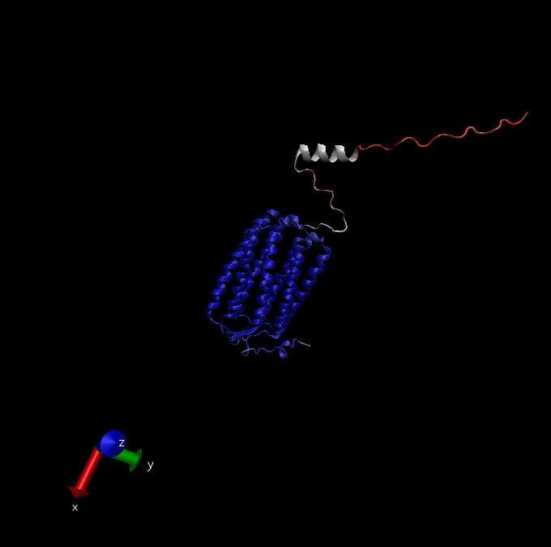
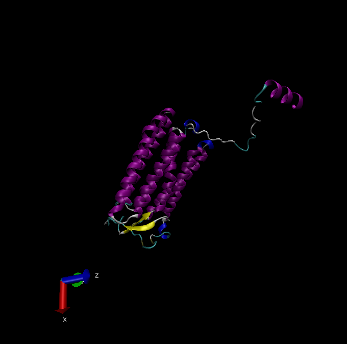

```{r setup, include=FALSE}
knitr::opts_chunk$set(echo = TRUE)
```

# AlphaFold

Using the predicted ORF sequence of my Find A Gene Project gene I find an 53.5% identity top hit in the AlphaFold database. Below is an image of this top hit predicted structure of an uncharacteristed protein as created in VMD.




Above is a picture with prediction score colouring (red = low prediction score, red, high prediction score), below is the same protein structure, but with any score below 50 removed, and coloured by secondary structure.




# Session Information

```{r Session Information}
# Record data on the session
sessionInfo()
```