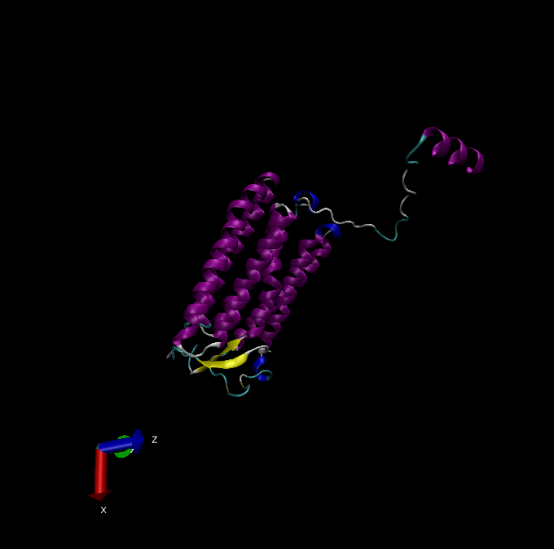

```{r setup, include=FALSE}
knitr::opts_chunk$set(echo = TRUE)
```

# Introduction

Analysis and investigation of PDB database.

After downloading data from PDB (<https://www.rcsb.org/stats/summary>), read it into R.

```{r Obtain Data}
# Read .csv data
dat <- read.csv("Data Export Summary.csv", header = T, row.names = 1)

```

# Question 1

```{r Q1 initial}
# Calculate number of structures solved by X ray or EM
X.ray.and.EM <- sum(dat$X.ray) + sum(dat$EM)
X.ray.and.EM

# Find the percentage this makes up
perc <- (X.ray.and.EM/sum(dat$Total))*100

print(paste("In PDB, X ray and EM derived structures account for", signif(perc, digits = 3), "% of the structures in the database (to 3 s.f.)."))
```

Another way to do this:

```{r Q1 alternative}
# Find the sum of each column (method)
n.type <- colSums(dat)

# Find the percentage of each method (column) of the total
percs <- signif((n.type/n.type["Total"] * 100), digits = 3)

percs

```

The proportion or percentage of X-ray structures is `r percs[1]`% of the total structures in PDB (at the time of summary statistics download).

The proportion or percentage of EM structures is `r percs[3]`% of the total structures in PDB (at the time of summary statistics download).

# Question 2

```{r Q2}
# Find number of protein only structures
p.only <- dat[1, "Total"]

# If one didn't know the row that was protein only, they could do the following
p.only.2 <- dat["Protein (only)", "Total"]
p.only.2

# Print answer
print(paste(p.only, "structures in the database are protein only structures, this is a ratio of 1:", signif(sum(dat$Total)/p.only, digits = 3)))

# Or assign it to a variable that can be called in the text
q2 <- signif(p.only/sum(dat$Total), digits = 3)*100

```

The percentage of structures in PBD that are protein only is `r q2`% (at time of download of summary statistics).

# Question 3

Question 3 requires no code, just a PDB search. The search "HIV" and "protease" restricted to all HIV-1 variants under SCIENTIFIC NAME OF SOURCE ORGANISM gives 874 structures. However, searching with different terms gives different numbers and other structures seem to creep in. A better way to search is by sequence, this can be found in the NCBI

Using a parital HIv-1 protease found on NCBI (accession number: BAA88351.1), gives 860 structures. Using chain A, HIV-1 protease (PDB: 3DOX_A) gives 860 structures too.

# VMD image insertion

After creating an image using VMD we can use code of the following format "exclamation-square-brackets-brackets with image name within them" to insert it into the markdown document.


Or you can insert using the visual editor, using no code.


# Question 4

While the water was not shown in the image I inserted in my report, in VMD one can display the water. When this is done, only the oxygen molecule is shown. This is because in many imaging techniques, hydrogen, the smallest atom, cannot be visualized. 

# Question 5

HOH308 found using "within 5 of resname MK1" with MK1 as liquorice and the protein in cartoonNew form.

# Question 6

There is a Beta-sheet composed of two beta-chains in one direction from monomer with a third beta-chain in the opposite direction from the other monomer in between them. This would be unlikely to exist if the two monomers were separated. Alpha helices are self-contained and so likely to exist in separate monomers. The remainder of the beta-sheets appear to only rely on H-bonding within the same polypeptide chain and so are probably stable as well. The remainder of the contacts between the monomers in the dimer appear to be in flexible loop regions, which, where they contact, may be hydrophobic and this might skew monomer structure but as the open acitve site is also at the contact surface of the two monomers this should hopefully not be too serious.

# Bio3D for strucutral bioinformatics

```{r Bio3D}
# Load the bio3d package
library(bio3d)

# Use the function to read PDB files from this package, I am using the file I downloaded, but I could also have used the protein tag and the function would have pulled the data from online
pdb <- read.pdb("1hsg.pdb")
pdb


```
In the information above MK1 stands for Merk1, a small molecule that was developed to target this protease.

```{r inspect loaded protein}
# To find the one letter code of three letter amino acids one can use aa321, as shown below
aa321("GLN")

# Within the read in object atom contains the data for each atom in the structure (as seen in the raw data file after scrolling down in a text editor)
head(pdb$atom)
```

## Questions 7 - 9
Q7: There are 198 amino acid residues in this pdb object? 

Q8: There are two non-protein residues, water (HOH) and MK1 (a small molecule).

Q9: There are two protein chains in this structure.

# Compartive analysis of protein structures

```{r PCA set-up, message=FALSE}

# Load necessary packages (after installing in console as necessary)
library("bio3d")
library("ggplot2")
library("ggrepel")
library("devtools")
library("BiocManager")
library("msa")
library("bio3d.view") # N.B. instructions were to use devtools::install_bitbucket("Grantlab/bio3d-view"), however, when attempting to use library("Grantlab/bio3d-view") 
# a second attempt of devtools::install_bitbucket("Grantlab/bio3d-view") returned a warning message that bio3d.view' had already been installed and so this nomenclature was used for loading

```
## Questions 10 -12
Q10: The `msa` package is not found in CRAN, only BioConductor, as it has to be installed using `BiocManager::install`.
Q11: The `Grantlab/bio3d-view` is found on neither the CRAN nor the BioConducter database.
Q12: TRUE, functions from the devtools package can be used to install packages from GitHub and BitBucket (using devtools::install_github() and devtools::install_bitbucket() respectively).


## Compartive analysis continued
Read a single ADK structure from teh database

```{r read in new protein}
# Read in the sequence of the POI
adk <- get.seq("1ake_A")

# Observe data
adk

```
### Question 12
The above output reveals there are 214 residues in this protein.

## Compartive analysis continued

Now we can find related sequences.

```{r blast}
# Search for further sequences
blast <- blast.pdb(adk)

# Plot summary statistics of results
hits <- plot(blast)
hits
```

This suggests that we should use the top 16 hits. We can get the IDs of these as follows.

```{r hit IDs}
# Print the IDs of the hits above the threshold
hits$pdb.id
```
We can now retrieve the protein sequences of these hits.

```{r download PDB files corresponding to hits}
# Download related PDB files
files <- get.pdb(hits$pdb.id, path="pdbs", split=TRUE, gzip=TRUE)
```
After which these files can be aligned.

```{r align protein sequences of hits}
# Align related PDBs
pdbs <- pdbaln(files, fit = TRUE, exefile="msa")
```
After extracting the sequences they can be aligned and plotted.

```{r plot sequence alignment of hits}
# Vector containing PDB codes for figure axis
ids <- basename.pdb(pdbs$id)

# Draw schematic alignment
plot(pdbs, labels=ids)
```
The plot portrays matched bases as grey and gaps in the sequence as white. Sequence conservation is represented by the red bar at the top of the figure. The sequences are all very similar with the exception of some gaps near the end. 

We can also view their structures superimposed:

```{r}
# Set up
library(bio3d.view)
library(rgl)

# Plot
view.pdbs(pdbs)
```

Ideally we should also annotate out sequences.

```{r}
# Annotate 
anno <- pdb.annotate(ids)

unique(anno$source)

anno
```
THis provides us with a list of the hits and some details about them that are useful to store for further reference.

# PCA

Finally, we can perform principle component analysis.

```{r PCA}
# Perform PCA
pc.xray <- pca(pdbs)
plot(pc.xray)
```
The graphs provide a snapshot of where the adenylate kinases vary most in structure. This can be used for clustering into more similar structures.

```{r cluster and plot structures}
# Calculate RMSD
rd <- rmsd(pdbs)

# Structure-based clustering
hc.rd <- hclust(dist(rd))
grps.rd <- cutree(hc.rd, k=3)


# Plotting
plot(pc.xray, 1:2, col="grey50", bg=grps.rd, pch=21, cex=1)

#Plotting results with ggplot2
library(ggplot2)
library(ggrepel)

df <- data.frame(PC1=pc.xray$z[,1], 
                 PC2=pc.xray$z[,2], 
                 col=as.factor(grps.rd),
                 ids=ids)

p <- ggplot(df) + 
  aes(PC1, PC2, col=col, label=ids) +
  geom_point(size=2) +
  geom_text_repel(max.overlaps = 20) +
  theme(legend.position = "none")
p
```
There are clearly three groups of proteins which cluster separately.

To visualuse these differences we can return to the structures.

```{r vizualise PC1}

# Visualize first principal component
pc1 <- mktrj(pc.xray, pc=1, file="pc_1.pdb")

view.xyz(pc1)

# Set colours to mirror variability
view.xyz(pc1, col=vec2color( rmsf(pc1) ))
```

Finally, we can plot the variability in 2D.

```{r Normal mode analysis}
# NMA of all structures
modes <- nma(pdbs)

# Plot
plot(modes, pdbs, col=grps.rd)

```
Structures are divided mainly into a red and a black group which vary in their fluctuations. A single protein belonging to the third 'group' is in green and most similar to the red group. Based on the hinging motion shown in the VMD visualization it is possible that these two main groups represent different formations (e.g. substrate bound and unbound) or two classes of kinases with relatively different sized substrates, requiring the greater hinging of the group portrayed in red above.


# AlphaFold

Using the predicted ORF sequence of my Find A Gene Project gene I find an 53.5% identity top hit in the AlphaFold database. Below is an image of this top hit predicted structure of an uncharacteristic protein as created in VMD.


Above is a picture with prediction score colouring (red = low prediction score, red, high prediction score), below is the same protein structure, but with any score below 50 removed, and coloured by secondary structure.




# Session Information

```{r Session Information}
# Record data on the session
sessionInfo()
```
