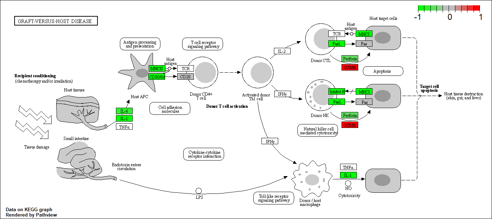

```{r setup, include=FALSE}
knitr::opts_chunk$set(echo = TRUE)
```

# Introduction

Today we will run differential expression analysis of some publshed data from Himes et. al.

First we need to do some set up, namely, we must load the required packages. Note that loading a package often causes several messages to be printed, while these are important, we do not necessarily want these messages in the report. Thus I have added `message = FALSE` to the r chunk below to prevent printing of these warning messages.

```{r Set-up, message = FALSE}
# Load packages
library("BiocManager")
library("DESeq2")
library("ggplot2")
```

The input data must also be loaded and assigned to r objects.

```{r Load input data}
# Assign data to r objects
counts <- read.csv("airway_scaledcounts.csv", row.names=1)
metadata <-  read.csv("airway_metadata.csv")

# Inspect both
str(counts)
head(counts)

str(metadata)
head(metadata)
```

The counts data contains quantitative measurements of expression for `r nrow(counts)` genes for `r ncol(counts)` conditions/observations. The metadata gives detail on these 8 conditions/observations.

#### Question 1
The number of genes, as stated above, is `r nrow(counts)`.

#### Question 2
The number of control experiments is `r sum(metadata$dex == "control")` (obtained using sum(metadata$dex == "control") as embedded code in the text). As there are 8 conditions this means we have 4 treated (with drug) and 4 control (without drug) experiments/conditions.

# Invesitigating drug effect

We can start to investigate whether the drug has any meaningful effect by doing exploratory differential expression analysis. First check that the metadata and the counts have the same conditions

```{r Check order}
# Do the conditions match
if(all(colnames(counts) == metadata$id)){
  print("The conditions in the two objects are in matching order and analysis can begin.")
}else{
  print("The conditions in the two objects do not match or are not in matching order, please do not continue to analysis until all conditions are in both objects and are in matching order.")
}
   # all() checks if ALL inputs are true

```
To simplify the analysis, we can first average control conditions and separately average treatment conditions. To do this first find all control conditions.

```{r Separate control conditions}
# Find IDs for control conditions and use them to pull control columns in counts
control.counts <- counts[ ,metadata$dex == "control"]

# Alternatively, this can be done using multiple steps
control.inds <- which(metadata$dex == "control") # gives the index/positions of the control conditions
control.counts <- counts[, control.inds] # uses the index vector to get the control conditions in counts

# Check the data
head(control.counts)

```

The control conditions are: `metadata[metadata$dex == "control", "id"]`.

We should do the same for the treated samples.

```{r Separate treated conditions}
# Find IDs for treated conditions and use them to pull treated columns in counts
counts.treated <- counts[ ,metadata$dex == "treated"]

# Check the data
head(counts.treated)

```

Find the mean count value for each row (i.e. gene). We could use `apply()` with `mean()` or `rowMeans()`.

```{r Average both subsets}
# Get average counts for both subsets
cc.avg <- rowMeans(control.counts)
ct.avg <- rowMeans(counts.treated)
```

#### Q3 and 4
Note that in the tutorial/handout, the following code is used:
`library(dplyr)`
`control <- metadata %>% filter(dex=="control")`
`control.counts <- counts %>% select(control$id)`
`control.mean <- rowSums(control.counts)/4`
`head(control.mean)`
Question 3 asks how this could be improved, one thing that could be done is the 4 could be changed to `length(control.counts)` so that if the number of controls changes then the division will not be incorrect. Alternatively, one could just use `rowMeans()` which would be more efficient then the combination of `rowSums()/length()`

#### Q5

These average values can then be plotted. Anything off a straight 1:1 line suggests differential expression.

```{r Plot averages}
# Make a single object input for ggplot.
avgs <- as.data.frame(cbind(cc.avg, ct.avg))

# Make plot for Q5
ggplot(avgs, aes(x = cc.avg, y = ct.avg)) +
  geom_point(pch = 21, alpha = 0.5, fill = "grey") +
  geom_abline(slope = 1) +
  labs(title = "Question 5 Plot (using geom_point)", x = "Mean Gene Expression in Control Experiments", y = "Mean Gene Expression in Treatment Experiments")

# Make plot with log scales Q6
ggplot(avgs, aes(x = cc.avg, y = ct.avg)) +
  geom_point(pch = 21, alpha = 0.05, fill = "grey") +
  geom_abline(slope = 1) +
  scale_x_log10() +
  scale_y_log10() +
  labs(title = "Question 6 Plot (using scale_x_log10() and scale_y_log10)", x = "Mean Gene Expression in Control Experiments", y = "Mean Gene Expression in Treatment Experiments")


```
It would be nice to colour by distance from the line.

```{r Plot averages with colour}
# Make a single object input for ggplot.
avgs <- as.data.frame(cbind(cc.avg, ct.avg, abs(as.numeric((cc.avg - ct.avg)/(cc.avg + ct.avg)))))
colnames(avgs) <- c("Control", "Treatment", "Difference")

# Make a good colour scale (code from stackoverflow)
library("RColorBrewer")
myPalette <- colorRampPalette(rev(brewer.pal(11, "Spectral")))
sc <- scale_colour_gradientn(colours = myPalette(100), limits=c(0, 1))

# Make plot
ggplot(avgs, aes(x = Control, y = Treatment)) +
  geom_point(aes(colour = Difference), alpha = 0.25, show.legend = FALSE) +
  geom_abline(slope = 1) +
  scale_x_log10() +
  scale_y_log10() +
  sc +
  labs(x = "Mean Gene Expression in Control Experiments", y = "Mean Gene Expression in Treatment Experiments")

```
Note while the above graph gives a nice visual effect, the colour scale is not meaningful (does not indicate significance) and is simply for reference.

A log 2 transformation can often be easier to interpret.

```{r Log 2 transformations}
# A log 2 fold change of 1 is a doubling
log2(40/20)

# Obtain log 2 changes of the input data
log2fc <- log2(ct.avg/cc.avg)

```

It is worth making a dataframe at this point to store all important data together.


```{r Organise data}
# Keep data organised by putting it together
meancounts <- data.frame(cc.avg, ct.avg, log2fc)
head(meancounts)
```

This also shows that we have some problems, there are some values that are `NaN` (Not a Number) and `-Inf` (negative Infinity). To avoid this we can remove all rows with a zero in them.

```{r Remove zeros}
# Find positions of zeros
ind <- unique(which(meancounts[, 1:2] == 0, arr.ind = TRUE)[, "row"]) #adding the [, "row"] gives just the row and no the column of where the 0 is (as any row with a 0 will be removed, regardless of the column where the 0 is found); unique ensures that row numbers are not repeated if both columns have a 0 in them

# Remove rows which have a zero
meancounts.nz <- meancounts[-ind,]

# Check successful
head(meancounts.nz)
```

#### Question 7

An explanation of how `ind` was created is founded
  - `which()` will find all instances in columns 1 and 2 (thanks to [,1:2]) which are 0 (thanks to == 0), however it will return these as if the two columns where one single vector, with the 1st value in the 2nd column equal to 1 + length of first column etc etc.
  - The `arr.ind` argument, when true, causes it to instead return both the row and column value of each TRUE.
  - The [, "row"] tells r we only require the column of row numbers `which(, arr.ind = TRUE)` returns because it does not matter which column the zero is present in, if a zero is present in either column the whole row must be removed.
  - The `unique()` function ensures that if there are some rows where both columns are zero, and thus the row number is returned twice, it is only shown once in the ind vector.
  
## Analysis of the refined dataset.

It is worth doing some analysis of this refined dataset.

```{r Analysis of meancounts.nz}
# How many genes are left?
gl <- nrow(meancounts.nz)
print(paste("Of", nrow(meancounts), "original genes present in the dataset,", nrow(meancounts.nz), "are left after removing all rows with a zero. This is a difference of", nrow(meancounts) - nrow(meancounts.nz), "genes."))

# How many have a log 2 fold change (log2fc) > 2?
g2 <- sum(meancounts.nz[,3] > 2)

```
There are `r gl` genes left after removing all rows with a zero. There are `r g2` genes among these which have a log 2 fold change greater than 2. This is `r (g2/gl)*100`% of the genes with non-zero expression in both conditions.

However, these differences may have no significance, we need to consider the variation within the control group before comparing their average to that of the treatment group. We are going to calculate p values and use multiple testing correction given we are analyzing data for so many genes. 

Additionally, we may be missing important changes by removing entries where only one column has 0, to include these would require using pseudocounts which we will not consider today.

#### Questions 8, 9 and 10

```{r Up and down expression analysis}
up.ind <- meancounts.nz$log2fc > 2
down.ind <- meancounts.nz$log2fc < (-2)
```

Q8 & 9: There are `r sum(up.ind)` genes which have a greater than log2 fold upregulation in gene expression, and `r sum(down.ind)` are downregulated with a magnitude greater than a log2 fold change.

Q10: Whether these figures can be trusted has already been partially discussed above. Without knowledge of variation within the control it is hard to determine whether variation from the mean of the control by the mean of the treatment is significant or simply normal. Clearly we require statistical testing to generate results we can interpret with confidence.

# DESeq2

As explained at the end of the previous section, we need to include statistics, we can do so with DESeq2. This package was already loaded in the set-up at the beginning of this document. Thus we can move straight to data conversion into a format DESeq2 can read.

```{r DESeq2 input data}
# Convert data into a format the DESeq2 package can use
dds <- DESeqDataSetFromMatrix(countData = counts, colData = metadata, design = ~dex)

# Check this object
dds
```
We can then run `DESeq` to obtain results including statistics.

```{r DESeq2 run}
# Obtain results
dds.r <- DESeq(dds)
res <- results(dds.r)

# Inspect results
res
```

A volcano plot will be a nice summary figure of these results, plotting p value (or more specifically an adjusted version of it) and log2 fold change.

```{r Plot dds results}
# ggplot

# Make a good colour scale (code inspired by stackoverflow)
myPalette <- colorRampPalette(rev(brewer.pal(11, "Spectral")))
sc2 <- scale_colour_gradientn(colours = myPalette(100), limits=c(0, 175))

# plot
ggplot(as.data.frame(res), aes(x = log2FoldChange, y = -log(padj))) +
  geom_point(alpha = 0.75, aes(col = -log(padj))) +
  labs(y = "-log of Multiple Testing Adjusted p Value", x = "Log2 Fold Change in Gene Expression") +
  sc2 # The colour scheme initiated earlier


```
The colour scale above is not as meaningful, rather it would be better to colour with thresholds in mind. Specifically:
  0.05 for p value
  -2 and +2 for log2 fold change
  
```{r plot res with a threshold colours}
# plot with a meaningful colour scheme

#first add another column for one threshold
res.c <- cbind(as.data.frame(res), (res$padj < 0.05))

#add another column for other threshold
res.c2 <- cbind(as.data.frame(res.c), (abs(res$log2FoldChange) > 2))

#fix names
cn <- colnames(as.data.frame(res))
colnames(res.c2) <- c(cn, "t.padj", "t.log2fc")

ggplot(res.c2, aes(x = log2FoldChange, y = -log(padj))) +
  geom_point(alpha = 0.75, aes(col = t.padj)) +
  labs(y = "-log of Multiple Testing Adjusted p Value", x = "Log2 Fold Change in Gene Expression") 

ggplot(res.c2, aes(x = log2FoldChange, y = -log(padj))) +
  geom_point(alpha = 0.75, aes(col = t.log2fc)) +
  labs(y = "-log of Multiple Testing Adjusted p Value", x = "Log2 Fold Change in Gene Expression") 

# To get one plot that has both requires one more column
res.c3 <- cbind(res.c2, (res.c2$t.padj + res.c2$t.log2fc) == 2)
colnames(res.c3) <- c(colnames(res.c2), "col.both")

ggplot(res.c3, aes(x = log2FoldChange, y = -log(padj))) +
  geom_point(alpha = 0.75, aes(col = col.both)) +
  labs(y = "-log of Multiple Testing Adjusted p Value", x = "Log2 Fold Change in Gene Expression", col = "Passes both thresholds?") +
  geom_vline(xintercept=c(-2, 2), col="red") +
  geom_hline(yintercept=-log10(0.05), col="red")


```
The code to make this last plot was a little excessive, but only because I worked slowly through how I created the plot, to make sure that I plotted correctly. A more experienced user could have used far less code to make this plot.

# Question 11 onwards are after this point, which was where the class ended on Wednesday.
# Continue on from this point on Friday.

# Adding annotation data

To help interpret our results we need to understand what the differentially expressed genes are. A first step here is to get the gene names in a format we can understand (i.e. gene SYMBOLs).

For this the following packages needed to be installed as follows:
- BiocManager::install("AnnotationDbi")
- BiocManager::install("org.Hs.eg.db")

Then we can load the packages (this must be done every time and thus we can include it in a code chunk, unlike the package installation).

```{r Load annotation packages}
# Load annotation package
library("AnnotationDbi")

# Load package containing all annotations for the human genome
library("org.Hs.eg.db")

# Inspect the org.Hs.eg.db package
columns(org.Hs.eg.db)
```
The columns in `org.Hs.eg.db` represent the possible databases we can take gene names/identifiers from.

We can now proceed with annotation using the `mapIDs()` function from the `AnnotationDbi` package to map gene identifiers of a more human-friendly (readable) format to each row (using the row names which are themselves gene identifiers). We can then add these to the results object we have already made using `DESeq2`.

```{r mapID()}
# mapID() function
res$symbol <- mapIds(org.Hs.eg.db,
                     keys=row.names(res), # Our gene identifiers
                     keytype="ENSEMBL",        # The format of the gene identifiers from keys
                     column="SYMBOL",          # The new format we want to add 
                     multiVals="first")     # There can be multiple transcripts per gene, we only want the first (the highest frequency version), note this one to many mapping

# Check this was successful
head(res)
```
#### Question 11

We can also use the same function to add further columns with the identifiers other databases give our gene identifiers (currently the row names in the `res` object).

```{r Q11}
# Add entrez gene identifiers
res$entrez <- mapIds(org.Hs.eg.db,
                     keys=row.names(res), # Our gene identifiers
                     keytype="ENSEMBL",        
                     column="ENTREZID",        
                     multiVals="first") 

# Add uniprot gene identifiers
res$uniprot <- mapIds(org.Hs.eg.db,
                     keys=row.names(res), 
                     keytype="ENSEMBL",   
                     column="UNIPROT",    
                     multiVals="first")   

# Add gene names
res$gene.name <- mapIds(org.Hs.eg.db,
                     keys=row.names(res), 
                     keytype="ENSEMBL",   
                     column="GENENAME",      
                     multiVals="first")     

# Check this was successful
head(res)

```
The results can also be ordered for better viewing.

```{r order results}
# Order the results by p value and place the index of these orders in a vector
ord <- order( res$padj )

# View the results ordered by the index vector of ordered p values
head(res[ord,])

# Save these results for later
write.csv(res[ord,], "deseq_results.csv")

```

# Improved Volcano Plot

We can also now make an improved volcano plot using the gene names we have added to the results object `res`.

```{r Set up}
# Load package for better volcano plots (make sure this package has already been installed)
library("EnhancedVolcano")

# Plot with this package
x <- as.data.frame(res)

EnhancedVolcano(x,
    lab = x$symbol,
    x = 'log2FoldChange',
    y = 'pvalue')

```


# Pathway analysis

We can now do pathway analysis, GO is one of the most commonly used first for this. KEGG is good for metabolic pathways. First we need to load some packages for data analysis (make sure these are already installed before loading).

```{r Load pathway analysis packages}
# Load packages
library(pathview)
library(gage)
library(gageData)

# Load data
data(kegg.sets.hs)

# Examine the first 2 pathways in this KEGG set for humans
head(kegg.sets.hs, 2)

```
Gage requires a named vector of fold changes, and requires names to be of the Entrez gene IDs type. 

```{r Format data for Gage}
# Make a fold change vector
foldchanges <- res$log2FoldChange

# Set names of each value to the entrez gene ID
names(foldchanges) <- res$entrez

# Check this has worked
head(foldchanges)

```
Now that the data is in an appropriate format we can run the analysis.

```{r KEGG analysis}
# Run KEGG analysis
keggres <- gage(foldchanges, gsets=kegg.sets.hs, same.dir=TRUE)

# Check results
attributes(keggres)

str(keggres)

```

We can also look within the these attributes, for example, we can look at the pathways which have a lot of down-regulated and up-regulated genes.

```{r Top three down pathways}
# Look at the first three down (less) pathways
head(keggres$less, 3)

# Look at the first three up (greater) pathways
head(keggres$greater, 3)
```

The data from this analysis can be plotted using the `pathview()` function from the pathview package. To simplify the initial test of this package, I will initially view a single pathway, using `pathway.id` and choisng the asthma pathway which showed up in the top three down-regulated pathways above.

```{r pathview of asthma pathway}
# Diagram of asthma pathway up and down regulation of genes
pathview(gene.data=foldchanges, pathway.id="hsa05310")

# A different PDF based output of the same data
pathview(gene.data=foldchanges, pathway.id="hsa05310", kegg.native=FALSE)
```


#### Question 12

The same logic can be used for other pathways in our dataset. For example, we can look at the top two down-regulated pathways.

```{r top down-regulated pathways}
# Find the top two down-regulated pathways
head(keggres$less, 2)

# Diagram of these pathways
pathview(gene.data=foldchanges, pathway.id="hsa05332")
pathview(gene.data=foldchanges, pathway.id="hsa04940")

```



# Optional section on plotting genes of interest

First we can find a gene of interest within our results, for example, we could focus on CRISPLD2.

```{r Find gene}
# Find index of CRISPLD2
i <- grep("CRISPLD2", res$symbol)

# Call this index
res[i,]

# Find the rowname for CRISPLD2
rownames(res[i,])

# Return the data
d <- plotCounts(dds, gene="ENSG00000103196", intgroup="dex", returnData=TRUE)
head(d)

```
This data can then be plotted.

```{r Plot gene data}
# Plot using ggplot
ggplot(d, aes(dex, count, fill=dex)) + 
  geom_boxplot() + 
  scale_y_log10() + 
  labs(main = "CRISPLD2", fill = "Condition", x = "", y = "Count")

```


# Session wrap up

Include session information at the end of the document for repeatability and transparency.

```{r}
sessionInfo()
```

